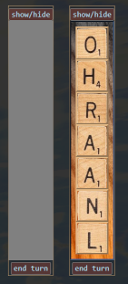
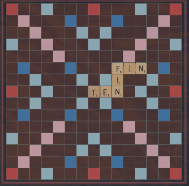
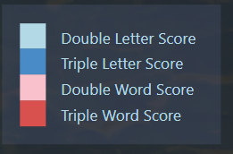
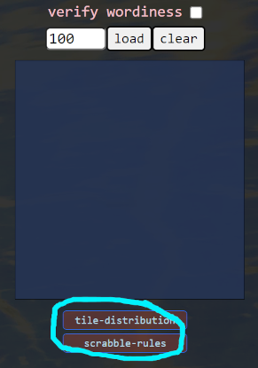

# scrabble  
### it starts with a single letter   

> _tl;dr;_  
> this is a full accounting of the ordeal  
> the links and a short game summary are at the bottom

As of 2:30 in the morning the day this project is due, I have come to accept certain limitations.  

Of the many things this project has taught me, the number one lesson must be the lesson about
taking on more than you can handle in the time you have to handle it.   

But the project has featured many small and, though some may be known only to me, large successes.  

Here is the project.  

-----
### i want to make a word game 
- it started with a large list of words

So the first challenge I took on was not actually too terrible, and it let me learn something about async functions and the fetch
function.  I used it to pull in json files I had downloaded of the officially approved (or so I believe) Scrabble word list.  

The idea was to be able to check words against this dictionary, automatically - although that goes against the spirit - and the rules - 
of Scrabble. Why not, though, this is my game. Maybe I'd just give you the option, at least.  

That ended up working, as far as checking the words in the end. It doesn't look like I'm going to be able to finish giving players the
option to back out gracefully, though, if they have hit 'end turn'.  

And THAT is because I didn't plan my functions well enough to be able to split out the parts that parse out the words from the parts that
are validating everything else and submitting, and basically I didn't keep my functions single-purpose enough.  

Which I suppose is major lesson #2.  And it is a side-effect of major lesson #1, which is to not take on way more than you can handle
in the allotted time, making you brute-force and rush everything with insufficient planning.

-----
### laying out the bag-of-tiles

But before the world seemed to grind into a tightening trap, the thing looked really nice. Some real clever _things_ went down. 
I procedurally generated a scrabble board. It had multiplier squares, marked with custom data-attributes so you could call them
like element.dataset.col, element.dataset.row, element.dataset.points, element.dataset.letter, even element.dataset.id just to make sure 
they were all unique.  Classes, all sorts of classes.  And to try to minimize the number of lines of code for the layout procedure, I got
_really_ _emphasizing-word_ clever, and I used numbers that when converted into binary showed the locations of the triple-word-scores and such --
you know, as ones! I was pretty pleased with myself. Bitwise-procedurally-generated-scrabble-board! That's on my resume.  

But my code now has over 1400 lines of JavaScript alone. And it doesn't quite work. So, you know. 

I don't regret that, by the way.

-----
### the graphics

I'm not a designer, as such, but I want control of where things go, so CSS was the next beast to fight with.  And in that, I am pretty satisfied.
I discovered some techniques for blending background images, to variously interesting and/or hideous effect, and lost some time in that. Otherwise, flexed my
flex skills quite a lot, and ended up, to my surprise, with a grid layout for the outer layout wrapper. 

-----
### the drag

But, speaking of the grid, one thing I discovered, is that when I tried to switch back to a flex outer layout, it broke my drag-and-drop. I can't figure out why.   
So I went back.  

And this is maybe the major achievement of this project, in terms of new skills acquired. My tile placement is done with the HTML5 drag-and-drop API. And it works pretty 
cleanly. It gave me nightmares, though.  It turned out that somewhere in my code rearrangements I had lost the [draggable="true"] attributes on my tiles, and yet they still 
were dragging after first failing. It wasn't so much non-functional as just very annoying.  A lucky guess brought me to the answer.

------
### other successes/challenges overcome

The worst/most frustrating period of the development was figuring out how to determine the adjacency of tiles on the board, in particular the adjacency of tiles to the 
crosswords, that is, to words already laid out which touch the newly laid word and form either new words from part or all of the perpendicular letters.  Also just accounting 
for gaps, but that's a bit easier.  

And you have to check it in all four directions.  

And there are many exceptions. And you can't score anything twice, except the tiles that are supposed to be scored twice. Sometimes it was necessary to mark certain tiles with a
special data-attribute to indicate they were countable as bases for an adjacent, er, vertex?, and sometimes it was just sorting them and looping in the right order. The debugger
became a dreaded friend.  

But I do believe I nailed it, in this particular case.  

Famous last words.  

-------
### the disappointment

Here's what I didn't manage that was on my personal I mean to do this list.   
- You can't ever play just one letter. I know how stupid that seems, and it is. But I couldn't get to it.
- You can only play top-down, and left-to-right.
- You really have to decide between players about word validity. My dictionary efforts are functionally useless to you. They will be in version 2.
- I am not enforcing center square on first play. I might add in later this morning, but I'm not sure I really want to.

There might be more, but it's depressing. You can still play. You can still lose. You can still win.

---------------

## THE GAME
#### The player tile trays   
   

hold the pieces that players take turns dragging onto   

#### the game board 
(the colored squares have multipliers...)   

   

...indicated in the legend.   

   

Score is tallied automatically (you can view the scoring rules by clicking the scrabble-rules button)   

   

### The Game Does Not Enforce All Of The Rules.  

- The game will show you if the words were in the dictionary, but if you hit end turn, we say your opponent let you get away with it. This is Scrabble, my friend, not Chutes and Ladders.   

- The rules say you have to use the center square on your first turn, but if you two decide you don't care about that rule... this game is not your mother, kids.   

- Don't try getting away with any of that playing just one tile business. You know it's a different algorithm don't you? If I can't immediately determine if you are in a row or a column, then I need a whole other function, my friend, and I just don't have the time. So just play two, you baby.

[scrabbles.netlify.app](https://scrabbles.netlify.app/)

